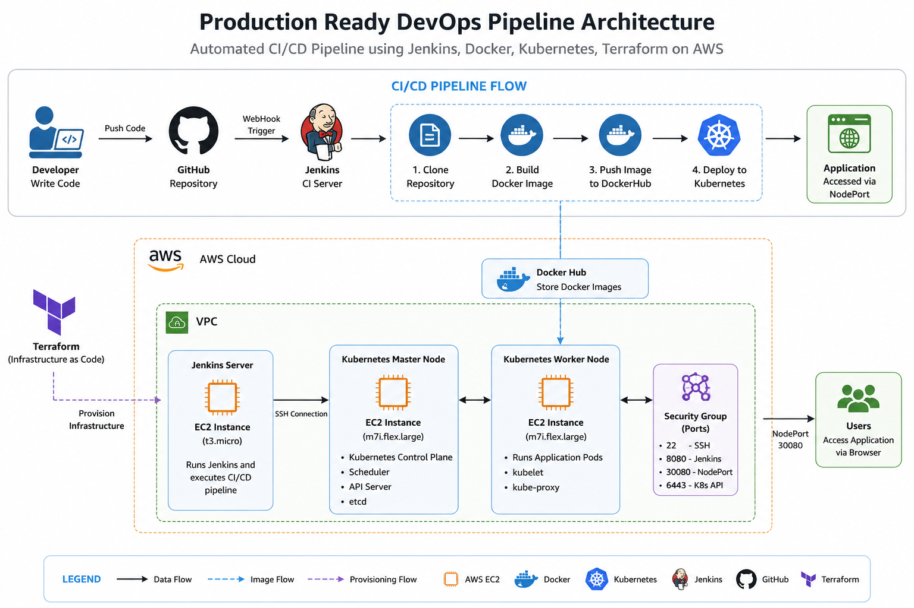
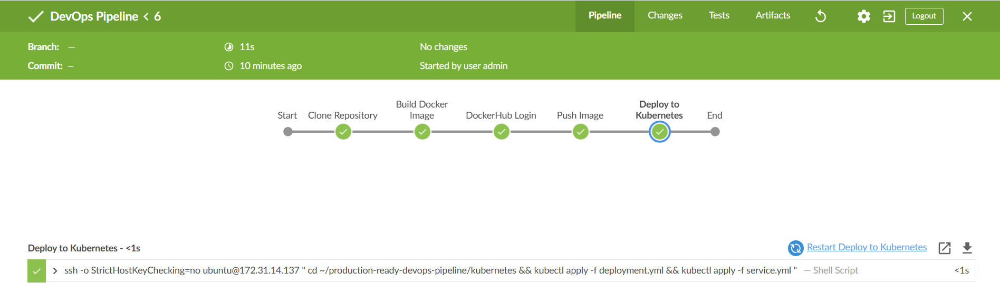
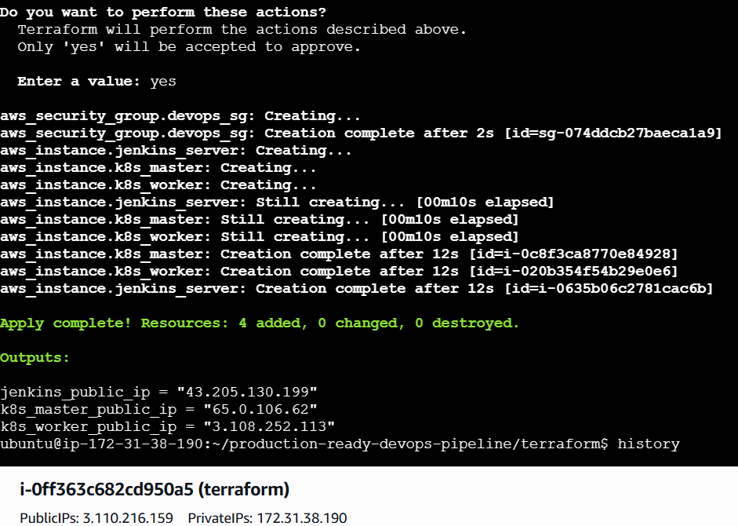
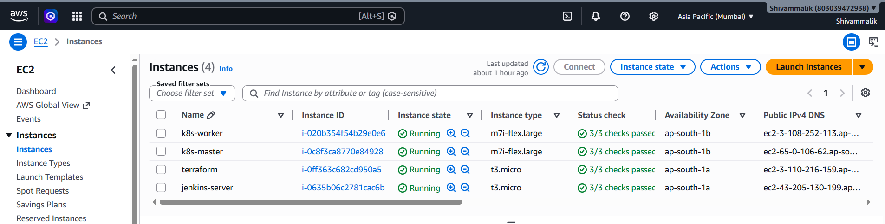
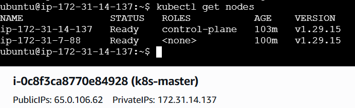
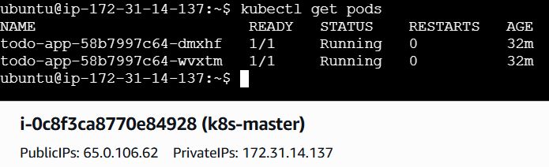
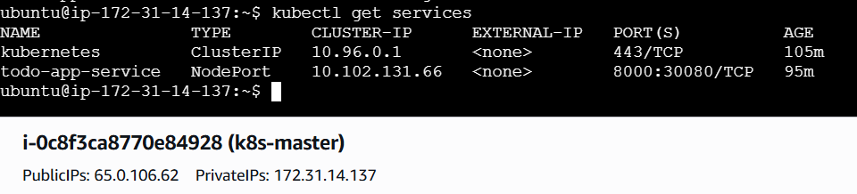
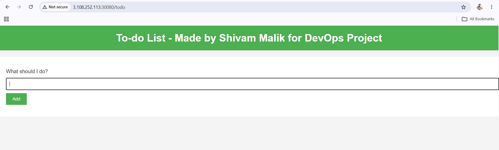

# 🚀 Production Ready DevOps Pipeline on AWS

<p align="center">


</p>

---

## 📌 Project Overview

This project demonstrates a complete **Production Ready DevOps CI/CD Pipeline** built using **Terraform, AWS, Jenkins, Docker, DockerHub, and Kubernetes**.

The pipeline automatically builds a Docker image, pushes it to DockerHub, and deploys the application to a Kubernetes cluster running on AWS.

---

# 🏗 Architecture

<p align="center">

</p>

---

# 🛠 Tech Stack

| Category | Technology |
|----------|------------|
| Cloud | AWS EC2 |
| IaC | Terraform |
| CI/CD | Jenkins |
| Containers | Docker |
| Registry | DockerHub |
| Orchestration | Kubernetes |
| Version Control | Git & GitHub |
| OS | Ubuntu Linux |
| Backend | Node.js |

---

# 🔄 CI/CD Workflow

```
Developer
    │
    ▼
GitHub
    │
    ▼
Jenkins
    │
    ├── Clone Repository
    ├── Build Docker Image
    ├── Push Docker Image
    └── Deploy to Kubernetes
             │
             ▼
      Kubernetes Cluster
             │
             ▼
      Application Running
```

### Jenkins Pipeline

<p align="center">

</p>

---

# ☁️ Infrastructure

Terraform provisions:

- Jenkins Server
- Kubernetes Master Node
- Kubernetes Worker Node
- Security Group

### Terraform Apply

<p align="center">

</p>

### EC2 Instances

<p align="center">

</p>

---

# ☸ Kubernetes Deployment

### Cluster Nodes

<p align="center">

</p>

### Running Pods

<p align="center">

</p>

### NodePort Service

<p align="center">

</p>

---

# 🌐 Application

The application is deployed on Kubernetes and exposed using a **NodePort Service**.

<p align="center">

</p>

---

# 📂 Project Structure

```
production-ready-devops-pipeline/
│
├── app/
├── docker/
├── terraform/
├── kubernetes/
├── jenkins/
├── architecture/
├── screenshots/
├── docs/
├── LICENSE
├── .gitignore
└── README.md
```

---

# 📚 Documentation

Additional project workflow documentation is available in:

```
docs/project-workflow.md
```

---

# 👨‍💻 Author

**Shivam Malik**

GitHub: https://github.com/Shivam-Malik-Dev

LinkedIn: https://www.linkedin.com/in/shivam-malik-59b13a29b/

---

## ⭐ If you found this project helpful, consider giving it a Star.